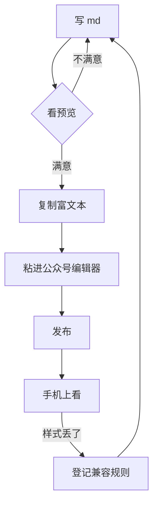
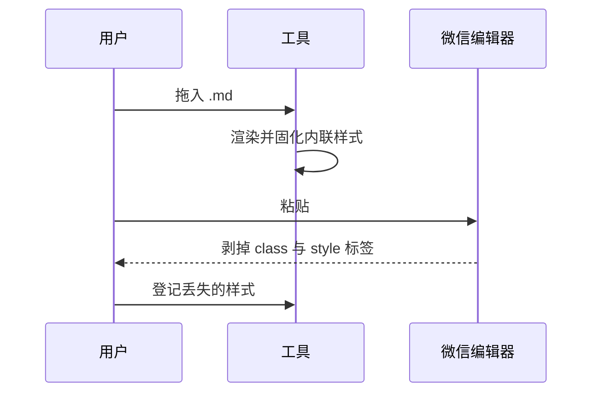
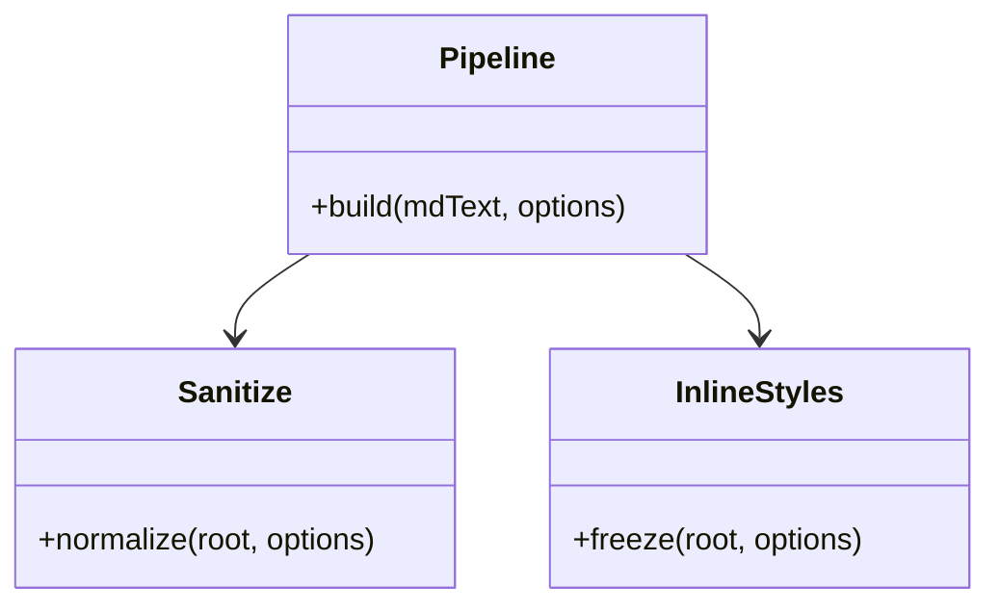
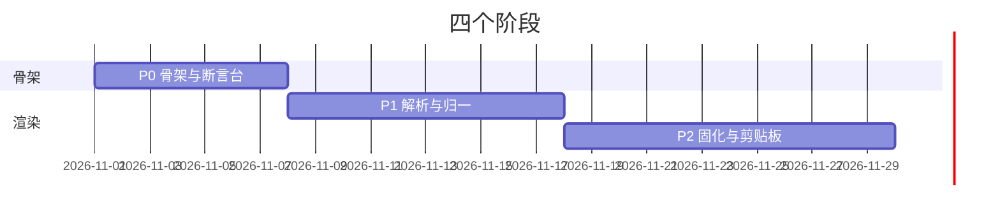
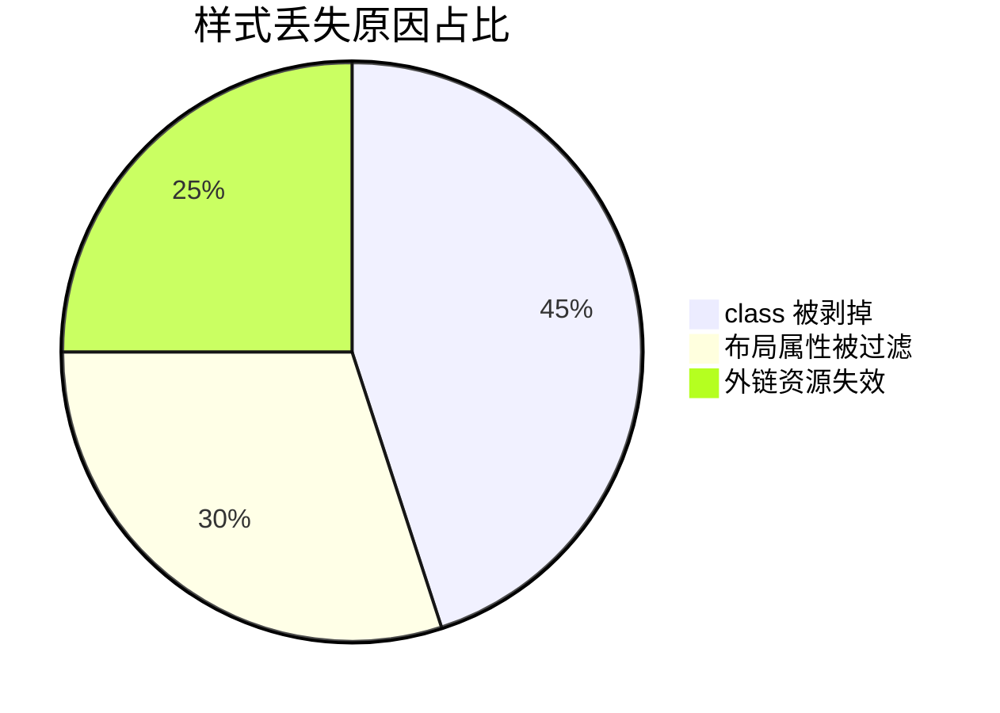

# Mermaid 图表样本

## 流程图

```mermaid
graph TD
  A[写 md] --> B{看预览}
  B -->|满意| C[复制富文本]
  B -->|不满意| A
  C --> D[粘进公众号编辑器]
  D --> E[发布]
  E --> F[手机上看]
  F -->|样式丢了| G[登记兼容规则]
  G --> A
```

## 时序图

```mermaid
sequenceDiagram
  participant U as 用户
  participant T as 工具
  participant W as 微信编辑器
  U->>T: 拖入 .md
  T->>T: 渲染并固化内联样式
  U->>W: 粘贴
  W-->>U: 剥掉 class 与 style 标签
  U->>T: 登记丢失的样式
```

## 类图

```mermaid
classDiagram
  class Pipeline {
    +build(mdText, options)
  }
  class InlineStyles {
    +freeze(root, options)
  }
  class Sanitize {
    +normalize(root, options)
  }
  Pipeline --> Sanitize
  Pipeline --> InlineStyles
```

## 甘特图

```mermaid
gantt
  title 四个阶段
  dateFormat YYYY-MM-DD
  section 骨架
  P0 骨架与断言台 :a1, 2026-11-01, 7d
  section 渲染
  P1 解析与归一 :a2, after a1, 10d
  P2 固化与剪贴板 :a3, after a2, 12d
```

## 空图表

```mermaid
```

## 语法错误的图表

```mermaid
graph TD
  A[ --> B
```

## 图与代码围栏混用

```mermaid
pie title 样式丢失原因占比
  "class 被剥掉" : 45
  "布局属性被过滤" : 30
  "外链资源失效" : 25
```

上面的图如果没被渲染成图，就必须原样显示成代码文本——绝不能显示成空白。
